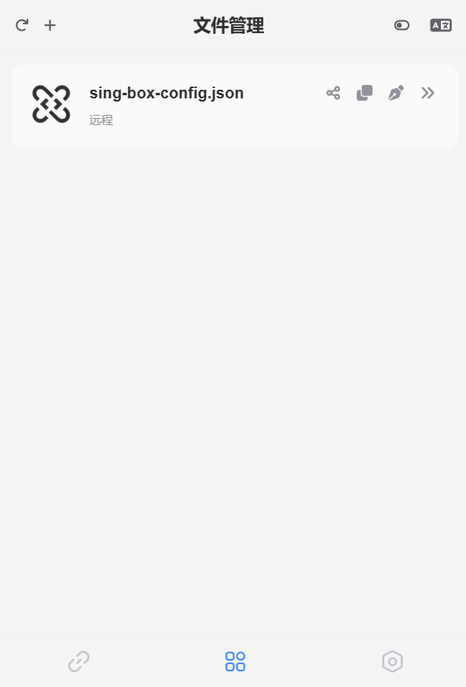
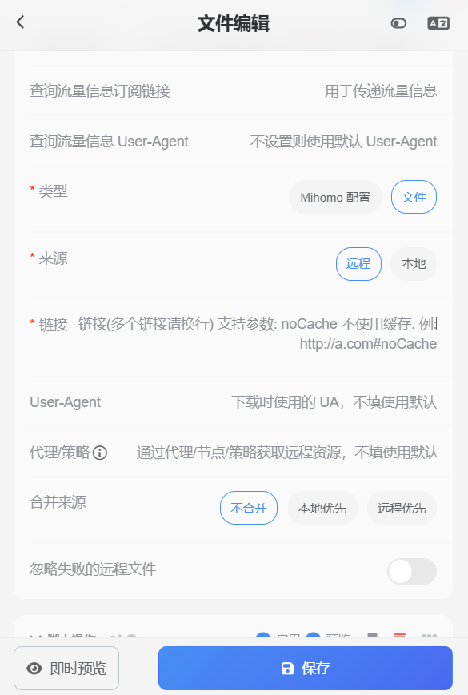
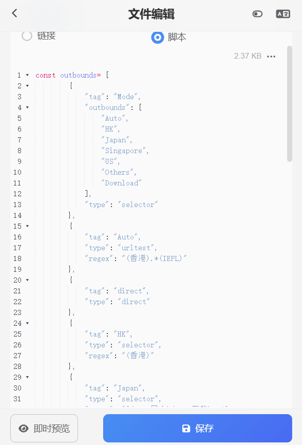

# sing-box-sub-merger

[English](./README.md)

适用于[Sub-Store](https://github.com/sub-store-org/Sub-Store)的节点合并快捷脚本，用于合并Sub-Store生成的Sing-Box节点列表到远程托管的配置文件中。

## 功能特性

🛠️ 节点过滤：支持正则表达式过滤节点，创建策略组。

🔄 自动更新：支持定期自动更新订阅节点。

📄 配置文件生成：生成符合 Sing-Box 格式的配置文件。

🧩 模块化设计：易于扩展和自定义。

## 前提条件

Sub-Store

## 使用方法

新建一个 Sub-Store 文件管理

  

在 `链接` 处填入远程托管的配置文件链接

  

将 `merge.js` 中的代码复制到脚本中，点击保存，即可使用
  
  

## 配置选项

- outbounds: [Sing-Box配置的outbounds项](https://sing-Box.sagernet.org/zh/configuration/outbound)，此处支持使用**正则表达式**筛选节点，需要包含原配置文件中的**完整配置**。

> 可遵循原版Sing-Box手动使用outbounds项指定节点，也可使用regex项筛选节点。**若同时使用outbounds和regex项，则outbounds项无效。**

## 许可证

本项目基于 ISC 许可证开源。
